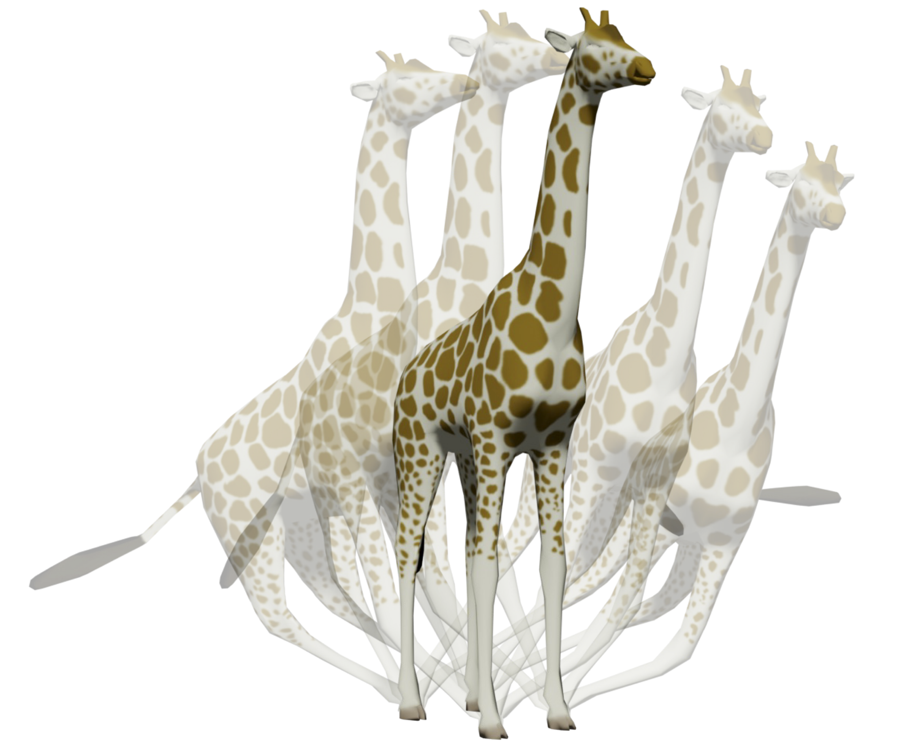

# Neural Modes: Self-supervised Learning of Nonlinear Modal Subspaces



Jiahong Wang, Yinwei Du, Stelian Coros, Bernhard Thomaszewski

IEEE/CVF Computer Vision and Pattern Recognition Conference (CVPR 2024)

#### [ArXiv Preprint](https://arxiv.org/abs/2404.17620)

#### [Supplementary Video](https://www.youtube.com/watch?v=e4eWEqHSiSU)

## Environment
To run the provided code, please [install Conda](https://conda.io/projects/conda/en/latest/user-guide/install/index.html) and create a Python environment using the following command.

`conda env create -f env.yaml`

Once finished, activate the environment.

`conda activate neuralmodes`

## Pretrained examples
We provide three pretrained examples (Sheet, Armadillo, and Giraffe) and two GUI apps for demonstration. First, download the pretrained checkpoint files from the [drive](https://drive.google.com/drive/folders/1Nt8k_8EEp7-EwOq12Qen8ae4Wh1Qlauy?usp=sharing). Then, add the downloaded `pretrained` folder to the project root directory. The final file structure will be as follows.
```
project
│   README.md    
│
└───pretrained
│   │
│   └───tet
│   │   │   
│   │   └───armadillo
│   │   │   │   model.pt
│   │   │
│   │   └───giraffe
│   │       │   model.pt
│   │
│   └───shell
│       └───sheet
│           │   model.pt
│   ...
```

__I. Latent space exploration__

Execute the following commands, and you can explore the latent space using the slider bars. Note that the GUI defaults to linear modes. You need to deselect the checkbox `Use linear modes` to use Neural Modes.

`python sheet_train.py --config configs/shell/sheet_pretrained.yaml`

`python armadillo_train.py --config configs/tet/armadillo_pretrained.yaml`

`python giraffe_train.py --config configs/tet/giraffe_pretrained.yaml`

__II. Subspace simulation__

To use the pretrained models for simulation, run the commands below. The simulation is initially paused. Click the checkbox `Run simulation` to start. Also, note that the GUI may default to linear modes, and you need to deselect the checkbox `Use linear modes` to use Neural Modes.

`python armadillo_simulation.py --config configs/tet/armadillo_pretrained.yaml`

`python giraffe_simulation.py --config configs/tet/giraffe_pretrained.yaml`

## Training
If you wish to train your own model, please run the following commands.

`python sheet_train.py --config configs/shell/sheet.yaml`

`python armadillo_train.py --config configs/tet/armadillo.yaml`

`python giraffe_train.py --config configs/tet/giraffe.yaml`

Once the GUI window opens, please click the button `Start training`, and the training will start. You can monitor your training using tensorboard.

`tensorboard --logdir checkpoints`

Since the training is self-supervised and does not overfit, we set it to be an infinite loop. You need to manually stop the training by pressing `Ctrl+C` when the training metric flattens. Reasonable iteration numbers for reference are:
- Sheet: 20k iterations
- Armadillo: 3k iterations
- Giraffe: 9k iterations

Your trained models are saved in the `checkpoints` folder specified by the field `checkpoint_dir` in the config yaml file. For sheet, the checkpoint directory is `checkpoints/shell/sheet`. In the checkpoint directory, you will see a list of checkpoints named `model_it{XXX}.pt`. 

To use the saved model for inference, open the config yaml file and replace `null` in the fields `saved_checkpoint` and `best_checkpoints` by the checkpoint file `model_it{XXX}.pt`. You can then explore the latent space or run simulation like the pretrained examples. For instance, `python sheet_train.py --config configs/shell/sheet.yaml` and `python armadillo_simulation.py --config configs/tet/armadillo.yaml`

## License
See the [LICENSE](./LICENSE) file for license rights and limitations.